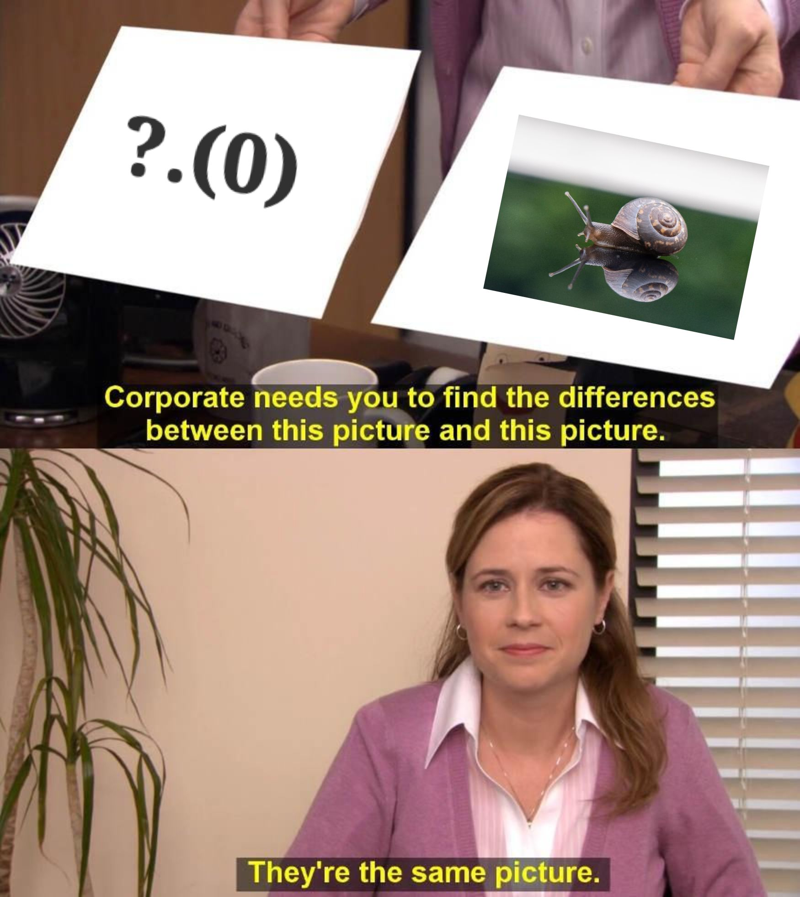

## What is Optional Chaining

[Optional Chaining](https://developer.mozilla.org/en-US/docs/Web/JavaScript/Reference/Operators/Optional_chaining) is a new JavaScript language feature that allows a developer to access deeply-nested attributes from an object without the risk of throwing a runtime error by referencing an attribute on undefined.

It looks something like this:

```js
const person = {
  name: 'Nathan',
  hobbies: ['not using optional chaining']
}

const nathanHobbies = person.hobbies
const nathanHeight = person.profile?.dimensions?.height

console.log(nathanHobbies) // ['not using optional chaining']
console.log(nathanHeight) // undefined
```

Seems convenient, right? We don’t have to do a presence check on each nested object. Instead, our undefined object is safely returned.

So, what makes me so grumpy?

Honestly, it’s probably more of a personality flaw … but I’ll blame optional chaining for the time being.

## It’s Not That Bad

Let’s begin by taking a look at the above example, without optional chaining.

```js
const person = {
  name: 'Nathan',
  hobbies: ['not using optional chaining']
}

const nathanHobbies = person.hobbies
const nathanHeight = person.profile && person.profile.dimensions && person.profile.dimensions.height

console.log(nathanHobbies) // ['not using optional chaining']
console.log(nathanHeight) // undefined
```

My first thought when looking at this code is that I should probably just perform better data validation prior to accessing the deeply-nested height value. But, honestly, even without doing that, it’s not all that bad.

Line 7 has a somewhat tedious check, where I must confirm that each nested object exists before moving on to the next, but it can still easily live on one line and isn’t even terribly long.

In my eyes, this repetitive presence check can/should actually serve as a little slap on the wrist to the developer, encouraging them to properly validate their object so that they don’t need to perform such a check inside of the “business” logic.

I’ll use business logic here to refer to the logic that is related to the task at hand in each example (getting the height, in this case). We could imagine the rest of the application logic to include concerns such as data validation, error handling, framework-level boilerplate, and so on.

## Ad Hominem Attack on the Syntax

Now, let’s take a look at a method invocation.

```js
const maths = {
    add: (x, y) => x + y
}

const sum = maths.add(5, 6)
console.log(sum) // 11

const diff = maths.abs?.(5, 6)
console.log(diff) // undefined
```

Yes, believe it or not, that’s the real syntax for conditional method invocation.

Is it just me or does it sort of look like some amateur hour ascii art of a snail?



A question mark and a period preceding a pair of parentheses looks like nothing else in JavaScript that I can call to mind. It looks like an experimental language extension.

Because JavaScript doesn’t have wildly-divergent syntax, I can, generally speaking, guess how the language would choose to do something if I haven’t used that feature in a long time. That is, unless I’m dealing with a switch statement, which I will quite literally never remember how to write.

What I’m trying to argue here is that optional chaining betrays my intuitions about JavaScript’s syntax rules, adding a somewhat trivial amount of complexity to the language, in order to solve a “problem” that was already solved.

We have short-circuiting logical operators and ternaries to deal with this exact use-case.

## Feel the Pain

So far, I’ve largely argued that optional chaining is dumb “because I hate it,” but I’d like to give you a real reason.

See, there are times when presence checks can become much more tedious than they were in the examples from the previous sections. Sometimes, these checks can clutter up an otherwise simple and clean function.

This is the crux of my argument against optional chaining. That pain and clutter is a good thing. It’s telling you to write better code and that your code should be restructured to avoid this uncertainty.

The thing about doing a presence check with optional chaining is that the object remains an unknown entity, but the syntax doesn’t punish you for it. This means that you need to use this bit of safety again the next time that you choose to access the same property or method.

> As a compounding factor, any time that you use optional chaining (or the &&-based check), you’re now given either the value that you want or undefined.

That’s not a big deal if undefined is a potential value for that attribute, which you would have handled in the business logic anyway, but it further clutters your code if the value would have otherwise been known.

Let’s see how this works by extending our previous example a bit further.

```js
const maths = {
    add: (x, y) => x + y
}

const main = () => {
  const diff1 = maths.abs?.(5, 6)

  // We've injected our guard/vaidation into the business logic layer
  if (diff1 === undefined) {
    return -1
  }

  // We've already exited if abs is undefined, so we could
  // avoid this optional chaining in JS. In TS, this will
  // still raise a "property could be undefined" error.
  const diff2 = maths.abs?.(42, diff1)
  
  return maths.add(diff1, diff2)
}

main()
```

Now, every time that we want to reference maths.abs prior to an early return, we need to use a safe accessor and follow it with a presence check for the returned value. If we just handle this validation ahead-of-time, we don’t need safe accessors at all.

As a comparison, we can improve this contrived control flow by placing the presence check prior to any attempts at referencing the potentially undefined method.

```js
const maths = {
    add: (x, y) => x + y
}

const main = () => {
  // Validate data before using it.
  // Very naive, for illustration purposes only
  if (maths.abs === undefined) {
    return -1
  }

  // We know that properties/methods exist
  const diff1 = maths.abs(5, 6)
  const diff2 = maths.abs(42, diff1)

  return maths.add(diff1, diff2)
}

main()
```

In a real application, it’s unlikely that these data validation guards would live at the top of a function which performs business logic. You’re more likely to see this type of validation pushed off into a wrapper layer that can exit early, such that the invalid objects never reach your business logic.

This not only declutters your code but also drastically simplifies your life as a developer. Knowing that properties and methods exist at the call site means that you don’t need to constantly be on-your-guard about classic JavaScript bottom type errors like “undefined is not a function.”

## What About Default Values?

Suppose that you’re an anarchist, and you wrote some code that looks like this:

```js
const person = {
  name: 'Nathan',
  hobbies: ['not using optional chaining']
}

// Some men just want to watch the world burn
const nathanHeight = ((person.profile && person.profile.dimensions && person.profile.dimensions.height) !== undefined) && ((person.profile && person.profile.dimensions && person.profile.dimensions.height) !== null) ? person.profile.dimensions.height : -1
```

You need a default value for the height property, but you also don’t know if the various nested objects exist, so you’ve thrown it all together on one line. Wouldn’t it be a lot better to just use the optional chaining syntax?

I mean, yes. Objectively, this is less gross.

```js
const person = {
  name: 'Nathan',
  hobbies: ['not using optional chaining']
}

// I have not yet made up my mind on nullish coalesce
const nathanHeight = person?.profile?.dimensions?.height ?? -1
```

So, this doesn’t look nearly as bad, but it’s the same code, semantically. In other words, we haven’t addressed the problem. We’ve just made it less unsightly.

This is sort of like naming nested callbacks to avoid a pyramid of doom, even though the logic remains the same. Remember that old problem? From that pattern, we got Promises, and they’re super rad.

Here, we got a shorter syntax that, otherwise, does the same thing. Overall, I’d say it’s not really a win because it just makes it less painful to write code with a poor control flow.

Put simply, I have the same answer for setting defaults as I did for everything else: validate your data early on to avoid these problems.

**Footnote:** I would absolutely not recommend patching default values onto the object, as objects are passed by reference. This could lead to all sorts of confusing bugs. If an early exit doesn’t make sense, consider wrapping the object with a getter to safely return default values without modifying the original object.

## That’s That

To summarize, is JavaScript’s optional chaining the most harmful thing since goto? No.

But I think its use should still raise red flags. I’d argue that it indicates that your code could benefit from a refactor, with better data validation further up in the control flow.

Luckily for me, I can simply choose not to use it, as I haven’t yet found a need for it.

Much like the [nullish coalescing operator](https://developer.mozilla.org/en-US/docs/Web/JavaScript/Reference/Operators/Nullish_coalescing_operator), I currently believe that this language feature is adding noise in order to address a non-problem.

In general, a language with more syntax is going to be harder to manage than a language with less syntax (translation: have ya tried a Lisp??). This is important for JavaScript, in particular, because the spec must be forever backwards-compatible, else we break the internetzzz.

/endHotTakes 🔥

Remember, opinions can change. After all, it took me 6 months to stop hating TypeScript.

But I encourage you to leave your opinions below. Tell me where I’ve gone wrong here.

In the meantime, I’ll keep my eyes on that pattern matching proposal… Make good choices, TC39.

👋 Bye!
